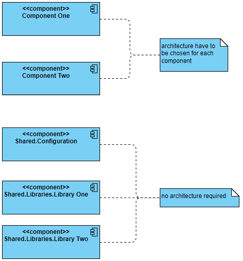

# 0001: Component Based Architecture

## Status
Accepted

## Context
Get Things Done is a monolith and there's a need to visualize and encapsulate contexts 
that are required in the project.

## Solutions
- Component-Based Architecture
- Feature-Based Architecture

## Decision
Use Component-Based Architecture as a high level architecture. Thanks to this it will be 
easier to manage different contexts. It is also not so granular as Feature-Based Architecture 
so amount of top level packages will be less.

## Consequences
- Each top level package requires own architecture;
- Communication between packages have to be managed carefully.  
- `shared` package for code used in various contexts:
  - `shared.configuration` - configuration used by many contexts
  - `shared.libraries` - code that may be extracted to separate library in some time from now

## Overview

