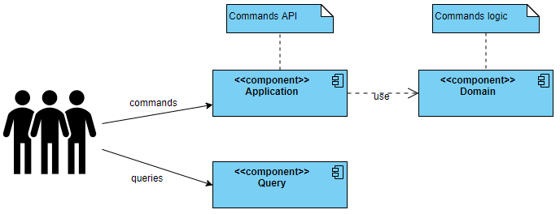

# 0002: Project Management - Command Query Responsibility Segregation

## Status
Accepted

## Context
Project Management is the Core context and its architecture need to support good design,
encapsulation and readability.  

## Solutions
- Command Query Responsibility Segregation
- No approach

## Decision
Command Query Responsibility Segregation will be used as an approach to separate domain model from read model.

## Consequences
- Duplicated interaction with persistence layer due to Read Model and Domain Model;
- packages structure
  - `application` - package that is the door to the commands
  - `query` - package where read model will be placed

## Overview

