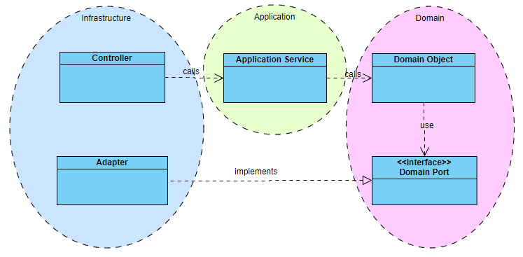

# Project Management - Hexagonal Architecture

## Status
Accepted

## Context
Project Management is the Core context and its architecture need to support good design,
encapsulation and readability.  

## Solutions
- Hexagonal Architecture

## Decision
Hexagonal Architecture will be used to separate domain logic from technical aspects of solution.

## Consequences
- packages structure
  - `application` - package that is the door to the business logic
  - `domain` - package with business logic
  - `infrastructure` - package where all primary and secondary adapters will be placed 
- `domain` package must take care of operations business atomicity
- `domain` package can contain only modifiable operations (create, update, delete)
- `application` package is a thin layer between `infrastructure` and `domain` and its only responsibility is translation of input data into domain objects. 
- no additional agreement for `infrastructure` package

## Overview

