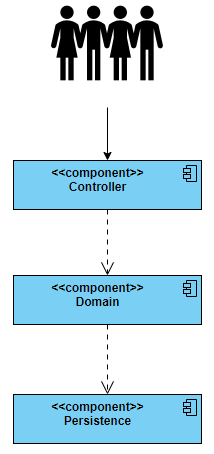

# 0004: User Management - Layered Architecture

## Status
Accepted

## Context
User Management should provider CRUD functionality for User's configuration.  

## Solutions
- Layered Architecture
- No Architecture

## Decision
Layered Architecture will make it easier to maintain the code. Also, 
if future decision make context more complex, it will be easier to migrate to different architectures. 

## Consequences
- packages structure
  - `controller` - package with exposed API
  - `domain` - package with business logic
  - `persistence` - package with persistence logic

## Overview

